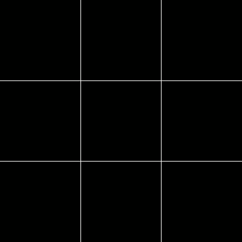
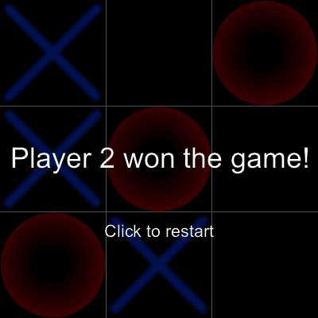

.. highlightlang:: lua
   :linenothreshold: 5

.. role:: lua(code)
   :language: lua

Basics: Tic-tac-toe
===================

This tutorial will teach you about some basic features (drawing primitives, colors, surface, fonts, mouse events) of
Drystal by creating a Tic-tac-toe_ game.

.. contents::
   :local:
   :depth: 3

Getting our first window
------------------------

First of all we need to get the Drystal table:

.. code::

    local drystal = require 'drystal'

Then, we define :lua:func:`drystal.init` which will be called by Drystal when the script will be loaded.

In this function we call :lua:func:`drystal.resize` with the width and height of our window.

.. code::

    local drystal = require 'drystal'
    local W, H = 400, 400

    function drystal.init()
        drystal.resize(W, H)
    end

Now that we have a window we define :lua:func:`drystal.draw` which will be called by Drystal when drawing the window.
This function will contain all the code needed to have beautiful graphics for our game. We start by drawing a black background
and through this tutorial you will see how we can complete this function.

When using Drystal drawing functions you need to set the color you want to use. For this there is :lua:func:`drystal.set_color`, it takes
RGB values (from 0 to 255) or a :lua:class:`.Color`.

.. note::
    Drystal provides a table, :lua:data:`drystal.colors`, which contains all of the
    `W3C colors <http://www.w3.org/TR/css3-color/#svg-color>`_.

After setting the right color, you just call :lua:func:`drystal.draw_background` and it's done.

.. code::

    function drystal.draw()
        drystal.set_color(drystal.colors.black)
        drystal.draw_background()
    end

.. image:: basics_black.png

Congratulation, you managed to get a fully functional window with a beautiful black background with Drystal! Don't worry this is just the
beginning of a wonderful adventure!

Drawing the board
-----------------

Having a black background is nice but we need to show our players where to put X or O. So let's draw a simple board with white lines, shall we?

For this we reuse :lua:func:`drystal.set_color` and use :lua:func:`drystal.draw_line` which draws a line between two points.
And we reuse the ``W`` and ``H`` variables (width and height) to draw lines that fit the window.

.. code::

    local function draw_board()
        drystal.set_color(drystal.colors.white)
        -- horizontal lines
        drystal.draw_line(0, H * 1 / 3, W, H * 1 / 3)
        drystal.draw_line(0, H * 2 / 3, W, H * 2 / 3)
        -- vertical lines
        drystal.draw_line(W * 1 / 3, 0, W * 1 / 3, H)
        drystal.draw_line(W * 2 / 3, 0, W * 2 / 3, H)
    end

    function drystal.draw()
        drystal.set_alpha(255)
        drystal.set_color(drystal.colors.black)
        drystal.draw_background()

        draw_board()
    end

.. image:: basics_board.png

Drawing sprites
---------------

Now we focus on drawing the noughts and crosses on the board by using `sprites <https://en.wikipedia.org/wiki/Sprite_(computer_graphics)>`_.

Loading the resources
^^^^^^^^^^^^^^^^^^^^^

First, we use our favorite image manipulation program to get a :download:`spritesheet <spritesheet.png>` with our
graphics. Then, we load this spritesheet with :lua:func:`drystal.load_surface` which give us a
:lua:class:`.Surface` that we can manipulate.

For instance, we can set the filter of the surface to :lua:data:`drystal.BILINEAR` in order to get a better surface
rendering.

Finally, we define a table containing the location of the sprites and their size. It will be needed later when we will
draw the sprites.

.. code::

    local drystal = require 'drystal'

    local W, H = 400, 400

    -- load resources
    local spritesheet = drystal.load_surface('spritesheet.png')
    spritesheet:set_filter(drystal.BILINEAR)
    local sprites = {
        { x=0, y=0, w=128, h=128 }, -- O
        { x=128, y=0, w=128, h=128 }, -- X
    }

Let's draw!
^^^^^^^^^^^

Now that we have our resources we can tell Drystal what to draw at each frame.

First, we keep a state of the game (i.e. where are the marks) and we define a matrix of 9 by 9 where
an empty string represents a free tile, ``x`` the player one, ``o`` the player two.

.. code::

    local board = {
        {'o', '', ''},
        {'o', '', 'x'},
        {'x', '', ''},
    }

Second, we tell Drystal from which :lua:class:`.Surface` to draw from, we can use the method
:lua:meth:`.Surface:draw_from` for this:

.. code::

    local function draw_marks()
        spritesheet:draw_from()

Last, for each tile in the matrix we draw a sprite or nothing according to its content.

Different functions can be used to draw sprites from the current surface. For this game we use
:lua:func:`drystal.draw_sprite_resized` which allows us to resize a sprite before drawing it. Since,
we divided the window into 9 tiles, the size of one tile is ``W / 3`` and ``H / 3``.

.. code::

    local function draw_marks()
        spritesheet:draw_from()
        for i = 1, 3 do
            for j = 1, 3 do
                local mark = board[i][j]
                local x = W * (j - 1) / 3
                local y = H * (i - 1) / 3
                if mark == 'x' then
                    drystal.draw_sprite_resized(sprites[2], x, y, W / 3, H / 3)
                elseif mark == 'o' then
                    drystal.draw_sprite_resized(sprites[1], x, y, W / 3, H / 3)
                end
            end
        end
    end

    function drystal.draw()
        drystal.set_color(drystal.colors.black)
        drystal.draw_background()

        draw_board()
        draw_marks()
    end

.. image:: basics_sprites.png

Getting mouse events
--------------------

We have a game that currently only display a hardcoded state of a game and I think we can agree on the fact that this
is not really a funny game. We need to let the players interact by clicking on the tile where they want to make a move.

Drystal calls :lua:func:`drystal.mouse_press` whenever a mouse button is pressed with the coordinate and which button
is pressed. We use this function to call another function that plays a turn according to the current player.

.. code::

    local function play()
        local i, j = highlighted_tile.i, highlighted_tile.j

        -- is there already a nought or a cross on this tile ?
        if board[i][j] ~= '' then
            return
        end

        -- set the tile
        board[i][j] = current_player

        -- switch player
        if current_player == 'x' then
            current_player = 'o'
        else
            current_player = 'x'
        end
    end

    function drystal.mouse_press(x, y, button)
        if button == drystal.BUTTON_LEFT then
            play()
        end
    end

Is there a winner ?
-------------------

Unfortunately, the game can not stop currently. For each move we need to check if one of the players won the game, this
way we can display a gameover screen and restart the game.

Checking if someone won in a tic-tac-toe game is fairly simple, we check if there is the same mark in a horizontal, vertical
or diagonal line:

.. code::

    local function check_winner()
        -- horizontal lines
        for i = 1, 3 do
            if board[i][1] ~= '' and board[i][1] == board[i][2] and board[i][2] == board[i][3] then
                return true
            end
        end
        -- vertical lines
        for j = 1, 3 do
            if board[1][j] ~= '' and board[1][j] == board[2][j] and board[2][j] == board[3][j] then
                return true
            end
        end
        -- diagonal lines
        if board[1][1] ~= '' and board[1][1] == board[2][2] and board[2][2] == board[3][3] then
            return true
        end
        if board[3][1] ~= '' and board[3][1] == board[2][2] and board[2][2] == board[1][3] then
            return true
        end
        return false
    end

There is also the case where no one won, so we check if the board is full:

.. code::

    local function check_board_full()
        for i = 1, 3 do
            for j = 1, 3 do
                if board[i][j] == '' then
                    return false
                end
            end
        end
        return true
    end

This ways, each time a player makes a move, we call ``check_winner()`` and ``check_board_full()`` to know if the game ended:

.. code::

    local function play()
        local i, j = highlighted_tile.i, highlighted_tile.j

        -- is there already a nought or a cross on this tile ?
        if board[i][j] ~= '' then
            return
        end

        -- set the tile
        board[i][j] = current_player

        if check_winner() then
            ended = true
        elseif check_board_full() then
            ended = true
            current_player = ''
        else
            -- switch player
            if current_player == 'x' then
                current_player = 'o'
            else
                current_player = 'x'
            end
        end
    end

We also make a function to restart the game when it is finished and a player clicked on the window:

.. code::

    local function restart()
        ended = false
        current_player = 'x'
        board = {
            {'', '', ''},
            {'', '', ''},
            {'', '', ''},
        }
    end

    function drystal.mouse_press(x, y, button)
        if button == drystal.BUTTON_LEFT then
            if ended then
                restart()
            else
                play()
            end
        end
    end

Gameover screen
---------------

The players would like to know who won the game or if there is a tie, so we need a proper gameover screen.

First, we load two fonts with :lua:func:`drystal.load_font` that will be used to write on the window who won:

.. code::

    -- load resources
    local font = assert(drystal.load_font('arial.ttf', 40))
    local smallfont = assert(drystal.load_font('arial.ttf', 24))

Then, we draw a transparent rectangle which fade the window by using :lua:func:`drystal.set_alpha`
and :lua:func:`drystal.draw_rect`. The former modifying the alpha channel which control the transparency
and the latter drawing a rectangle that we use to draw a rectangle the size of the window.

.. code::

    local function draw_gameover()
        -- fade the screen
        drystal.set_alpha(150)
        drystal.set_color(drystal.colors.black)
        drystal.draw_rect(0, 0, W, H)

        local text
        if current_player == 'x' then
            text = "Player 1 won the game!"
        elseif current_player == 'o' then
            text = "Player 2 won the game!"
        else
            text = "It's a tie!"
        end
        local _, htext = font:sizeof(text)
        drystal.set_alpha(255)
        drystal.set_color(drystal.colors.white)
        font:draw(text, W / 2, H / 2 - htext / 2, drystal.ALIGN_CENTER)

        smallfont:draw('Click to restart', W / 2, H * .7, drystal.ALIGN_CENTER)
    end

Finally, we update :lua:func:`drystal.draw` so that we call ``draw_gameover()`` when ``ended`` is ``true``:

.. code::

    function drystal.draw()
        drystal.set_color(drystal.colors.black)
        drystal.draw_background()

        draw_board()
        draw_marks()

        -- draw the winner
        if ended then
            draw_gameover()
        end
    end

Bonus: Highlighting the tiles
-----------------------------

We want the current player to know where the pointer is. For this we define a table ``highlighted_tile`` and we update it
with our definition of :lua:func:`drystal.mouse_motion` which will be called when the mouse is moved by the player.

.. code::

    local highlighted_tile = {i=-1, j=-1}

    function drystal.mouse_motion(x, y)
        highlighted_tile = {
            i = math.ceil(y / W * 3),
            j = math.ceil(x / H * 3),
        }
    end

Since we have the information about the mouse position we can draw the sprite (nought or cross) but with a bit of transparency
to show the difference between the pointer and a real cross or nought.

.. code::

    local function draw_marks()
        spritesheet:draw_from()
        for i = 1, 3 do
            for j = 1, 3 do
                local mark = board[i][j]
                local x = W * (j - 1) / 3
                local y = H * (i - 1) / 3
                if mark == 'x' then
                    drystal.set_alpha(255)
                    drystal.draw_sprite_resized(sprites[2], x, y, W / 3, H / 3)
                elseif mark == 'o' then
                    drystal.set_alpha(255)
                    drystal.draw_sprite_resized(sprites[1], x, y, W / 3, H / 3)
                elseif i == highlighted_tile.i and j == highlighted_tile.j then
                    drystal.set_alpha(100)
                    local sprite = current_player == 'x' and 2 or 1
                    drystal.draw_sprite_resized(sprites[sprite], x, y, W / 3, H / 3)
                end
            end
        end
    end

    function drystal.draw()
        drystal.set_alpha(255)
        drystal.set_color(drystal.colors.black)
        drystal.draw_background()

        draw_board()
        draw_marks()

        -- draw the winner
        if ended then
            draw_gameover()
        end
    end

Final code
----------

Here is the complete code of this tutorial, don't hesitate to improve it with your ideas, and if you want to know more
go to the next tutorial where we will show you how to do a space invader!

.. literalinclude:: basics.lua
   :language: lua
   :linenos:

.. _Tic-tac-toe: https://en.wikipedia.org/wiki/Tic-tac-toe

